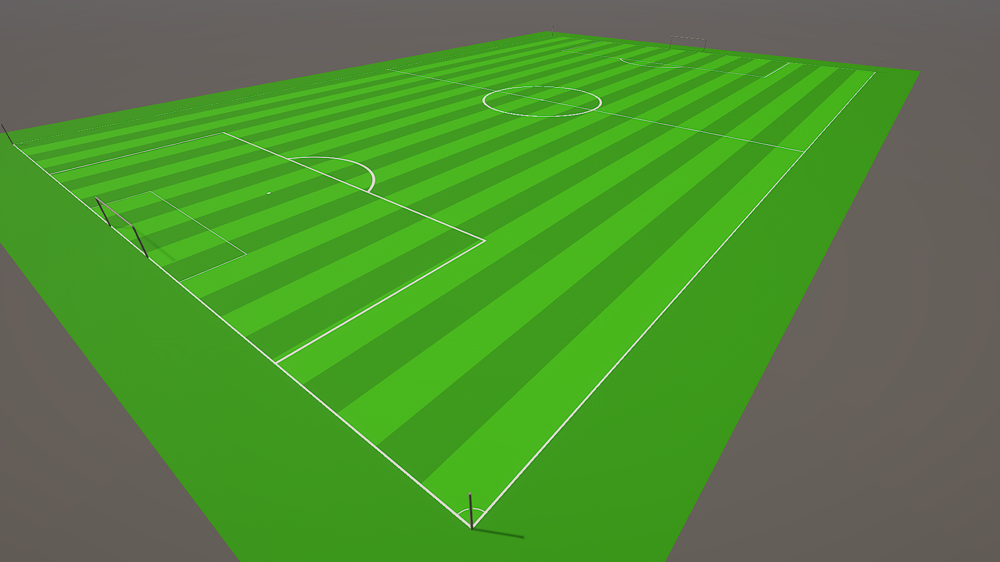

# FootballStadium

A simple **Unity URP** template for creating football stadium scenes, featuring a properly scaled pitch and a clean, editable starting setup.

## Overview

FootballStadium is a starter project created with **Unity 6000.3** using the **Universal Render Pipeline (URP)**.  
It is designed to be a solid foundation for anyone who wants to build, prototype, or experiment with football stadium environments in Unity.

The project includes:
- A properly scaled football pitch
- The pitch set up as a single GameObject in the scene, ready to be modified or extended
- A clean scene structure intended as a starting point

## Assets & Geometry

All objects in this project are:
- Created using simple Unity meshes
- Not imported from any external 3D software

## Rendering

- Unity version: **Unity 6000.3**
- Render pipeline: **Universal Render Pipeline (URP)**

## License

This project is **free to use for any purpose**.  
You are free to modify, redistribute, and use it in personal or commercial projects without restriction.

## Screenshot

